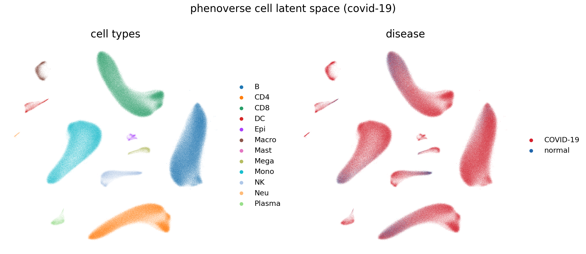
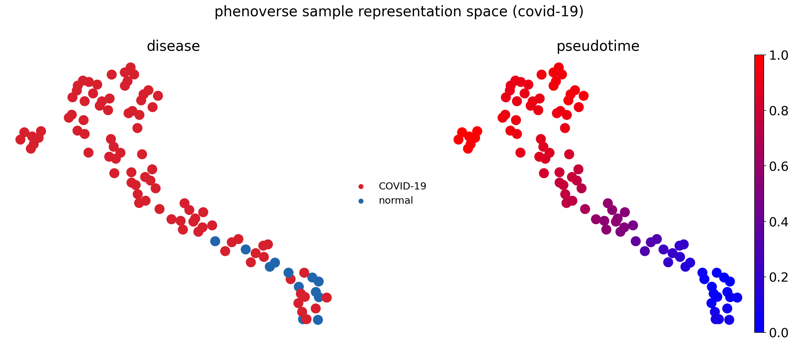
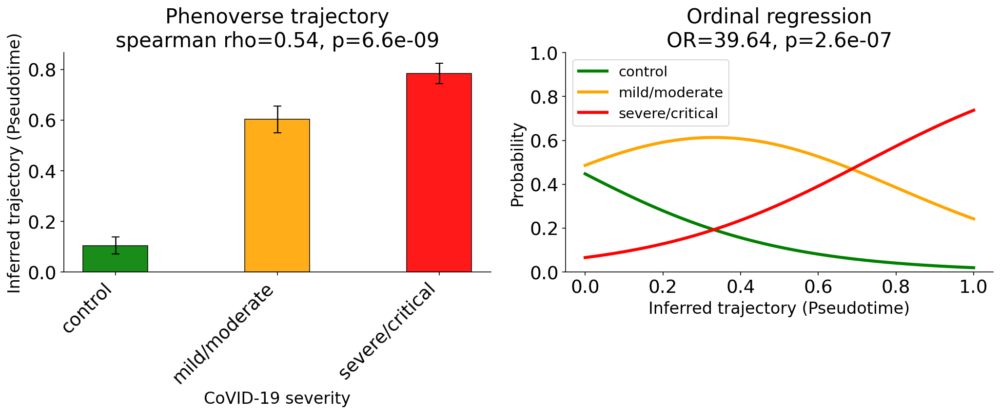
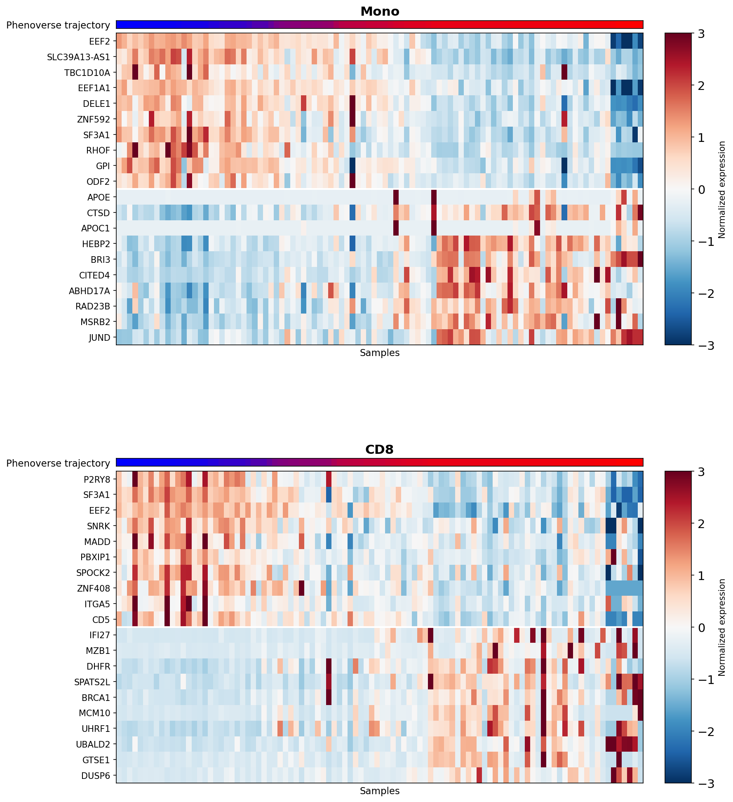
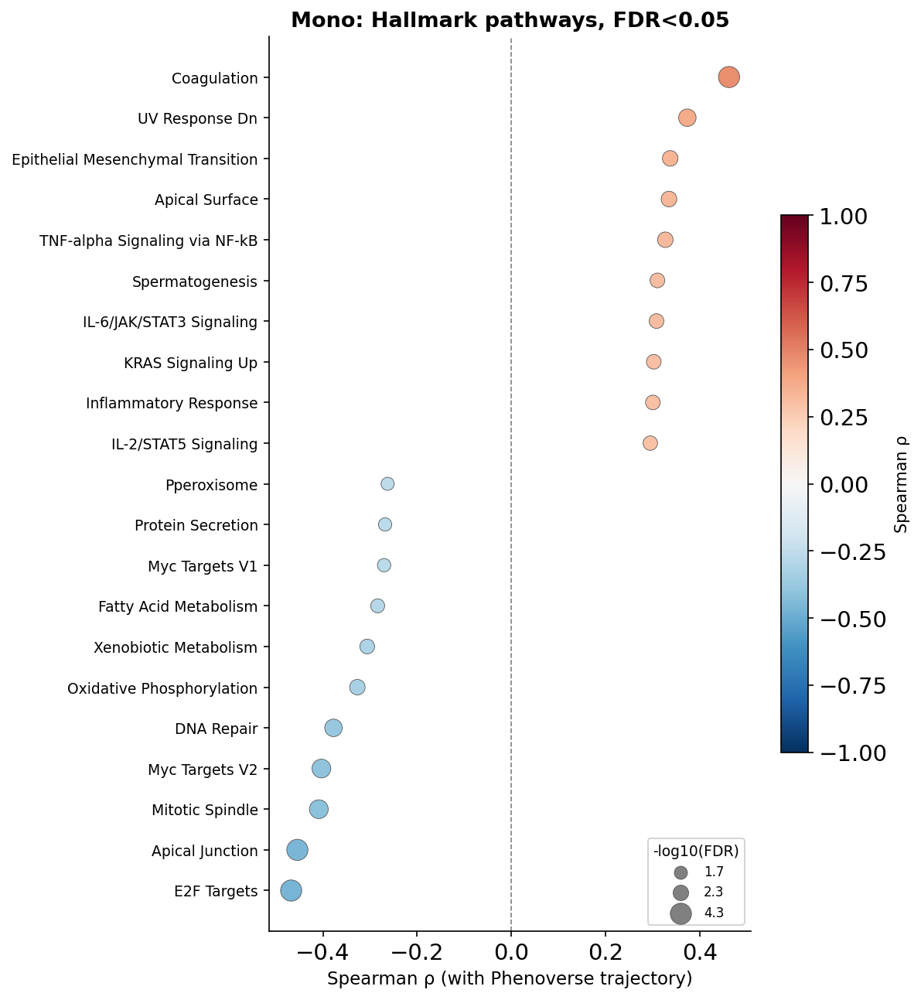
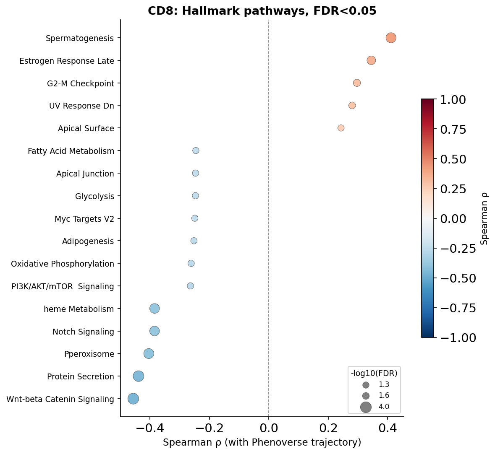

# COVID-19

[](https://pypi.org/project/Phenoverse/)
[](https://kellislab.github.io/Phenoverse/)

[](https://github.com/KellisLab/Phenoverse?tab=MIT-1-ov-file#readme)


## Dataset

In this tutorial, we will use a single-cell transcriptomic atlas of COVID-19 (Ren et al., 2021), comprising approximately 1.4 million cells. This dataset provides three disease severity measures (control, mild/moderate and severe/critical) which will use later to evaluate <code><span style="color: red;">Phenoverse</span></code> inferred trajectories.

Download the dataset:

```bash
wget -c -O "rna_COVID19.h5ad" "https://datasets.cellxgene.cziscience.com/481a2da9-2e61-424a-87e4-171e940006a4.h5ad"
```


## Pre-processing

<code><span style="color: red;">Phenoverse</span></code> expects raw counts in `.X`. The downloaded dataset stores normalized values in `.X`; We will assign `.raw` back onto `.X`. 

```python
import scanpy as sc

adata = sc.read_h5ad("rna_COVID19.h5ad")
adata.X = adata.raw.X.copy()
adata.raw = None
print(f"AnnData object with {adata.n_obs} cells and {adata.n_vars} features")
```

<div class="output-box">
<pre>
AnnData object with 1462702 cells and 27131 features
</pre>
</div>


## Train / Held-out split

We will split the dataset into training and held-out sets, stratified by `disease`.

```bash
# Install scikit-learn from the terminal if you haven't already
pip install scikit-learn
```

```python
import pandas as pd
from sklearn.model_selection import StratifiedShuffleSplit

sample_df = adata.obs[["donor_id", "disease"]].drop_duplicates()

splitter = StratifiedShuffleSplit(n_splits=1, test_size=0.5, random_state=42)
train_idx, heldout_idx = next(splitter.split(sample_df["donor_id"], sample_df["disease"]))

train_samples = sample_df.iloc[train_idx]["donor_id"].values
heldout_samples = sample_df.iloc[heldout_idx]["donor_id"].values

adata_train = adata[adata.obs["donor_id"].isin(train_samples)].copy()
adata_heldout = adata[adata.obs["donor_id"].isin(heldout_samples)].copy()

train_counts = adata_train.obs[["donor_id", "disease"]].drop_duplicates()["disease"].value_counts()
heldout_counts = adata_heldout.obs[["donor_id", "disease"]].drop_duplicates()["disease"].value_counts()

summary = pd.DataFrame({"Train": train_counts, "Held-out": heldout_counts})
print(summary)
```

<div class="output-box">
<pre>
          Train  Held-out
disease
COVID-19     85        86
normal       13        12
</pre>
</div>

Save the datasets:
```python
adata_train.write_h5ad("rna_COVID19_train.h5ad", compression="gzip")
adata_heldout.write_h5ad("rna_COVID19_heldout.h5ad", compression="gzip")
```


## Model training

We will now train the <code><span style="color: red;">Phenoverse</span></code> model on the training dataset.

```bash
phenoverse --setting train --train rna_COVID19_train.h5ad --phenotypelabel disease --samplecol donor_id --celltypecol majorType --checkpoint Phenoverse_COVID19_model.pth
```

<div class="output-box">
<pre>
INFO - 2026-07-10 05:22:10,737 - Starting to run...
INFO - 2026-07-10 05:23:09,085 - Raw data shape: (715070, 27131)
INFO - 2026-07-10 05:23:09,104 - Found 12 cell types: ['B', 'CD4', 'CD8', 'DC', 'Epi', 'Macro', 'Mast', 'Mega', 'Mono', 'NK', 'Neu', 'Plasma']
INFO - 2026-07-10 05:23:09,216 - Total samples: 98
INFO - 2026-07-10 05:23:09,216 - Training samples: 78
INFO - 2026-07-10 05:23:09,216 - Validation samples: 20
INFO - 2026-07-10 05:25:12,885 - Preprocessed data shape: (603979, 27131)
INFO - 2026-07-10 05:25:30,746 - Preprocessed data shape: (111091, 27131)
INFO - 2026-07-10 05:27:37,095 - Sample counts before balancing: {COVID-19: 68, normal: 10}
INFO - 2026-07-10 05:27:37,095 - Sample counts after balancing:  {COVID-19: 68, normal: 68}
INFO - 2026-07-10 05:27:37,095 - Total samples per epoch: 136
INFO - 2026-07-10 05:27:48,464 - [Epoch 1/400] TrainLoss=0.6983, ValLoss=0.6771
INFO - 2026-07-10 05:27:59,086 - [Epoch 2/400] TrainLoss=0.6868, ValLoss=0.6703
INFO - 2026-07-10 05:28:09,819 - [Epoch 3/400] TrainLoss=0.6743, ValLoss=0.6752
INFO - 2026-07-10 05:28:20,971 - [Epoch 4/400] TrainLoss=0.6611, ValLoss=0.6685
INFO - 2026-07-10 05:28:31,957 - [Epoch 5/400] TrainLoss=0.6501, ValLoss=0.6567
INFO - 2026-07-10 05:28:42,668 - [Epoch 6/400] TrainLoss=0.6310, ValLoss=0.6474
INFO - 2026-07-10 05:28:53,780 - [Epoch 7/400] TrainLoss=0.6118, ValLoss=0.6229
INFO - 2026-07-10 05:29:06,995 - [Epoch 8/400] TrainLoss=0.5936, ValLoss=0.6051
INFO - 2026-07-10 05:29:18,494 - [Epoch 9/400] TrainLoss=0.5650, ValLoss=0.5787
INFO - 2026-07-10 05:29:29,557 - [Epoch 10/400] TrainLoss=0.5342, ValLoss=0.5516
INFO - 2026-07-10 05:29:40,691 - [Epoch 11/400] TrainLoss=0.5058, ValLoss=0.5206
INFO - 2026-07-10 05:29:52,218 - [Epoch 12/400] TrainLoss=0.4682, ValLoss=0.4864
INFO - 2026-07-10 05:30:05,269 - [Epoch 13/400] TrainLoss=0.4204, ValLoss=0.4551
INFO - 2026-07-10 05:30:17,067 - [Epoch 14/400] TrainLoss=0.3835, ValLoss=0.4126
INFO - 2026-07-10 05:30:28,084 - [Epoch 15/400] TrainLoss=0.3430, ValLoss=0.3877
INFO - 2026-07-10 05:30:39,448 - [Epoch 16/400] TrainLoss=0.2941, ValLoss=0.3526
INFO - 2026-07-10 05:30:51,080 - [Epoch 17/400] TrainLoss=0.2528, ValLoss=0.3260
INFO - 2026-07-10 05:31:04,286 - [Epoch 18/400] TrainLoss=0.2192, ValLoss=0.3016
INFO - 2026-07-10 05:31:15,656 - [Epoch 19/400] TrainLoss=0.1881, ValLoss=0.2820
INFO - 2026-07-10 05:31:26,545 - [Epoch 20/400] TrainLoss=0.1581, ValLoss=0.2610
INFO - 2026-07-10 05:31:37,881 - [Epoch 21/400] TrainLoss=0.1251, ValLoss=0.2883
INFO - 2026-07-10 05:31:49,419 - [Epoch 22/400] TrainLoss=0.1065, ValLoss=0.2744
INFO - 2026-07-10 05:32:03,186 - [Epoch 23/400] TrainLoss=0.0809, ValLoss=0.2912
INFO - 2026-07-10 05:32:14,357 - [Epoch 24/400] TrainLoss=0.0700, ValLoss=0.3083
INFO - 2026-07-10 05:32:25,531 - [Epoch 25/400] TrainLoss=0.0544, ValLoss=0.3629
INFO - 2026-07-10 05:32:36,963 - [Epoch 26/400] TrainLoss=0.0459, ValLoss=0.3890
INFO - 2026-07-10 05:32:50,236 - [Epoch 27/400] TrainLoss=0.0388, ValLoss=0.4034
INFO - 2026-07-10 05:33:02,640 - [Epoch 28/400] TrainLoss=0.0323, ValLoss=0.4181
INFO - 2026-07-10 05:33:13,783 - [Epoch 29/400] TrainLoss=0.0278, ValLoss=0.4198
INFO - 2026-07-10 05:33:25,030 - [Epoch 30/400] TrainLoss=0.0231, ValLoss=0.4379
INFO - 2026-07-10 05:33:25,030 - [Model] Early stopping at epoch 30
INFO - 2026-07-10 05:33:25,071 - Saved checkpoint to Phenoverse_COVID19_model.pth
INFO - 2026-07-10 05:33:25,071 - Completed successfully!!
</pre>
</div>


## Held-out data

We can now apply the trained <code><span style="color: red;">Phenoverse</span></code> model to the held-out samples.

```bash
phenoverse --setting test --test rna_COVID19_heldout.h5ad --checkpoint Phenoverse_COVID19_model.pth --samplecol donor_id --celltypecol majorType
```

<div class="output-box">
<pre>
INFO - 2026-07-10 05:33:41,185 - Starting to run...
INFO - 2026-07-10 05:37:03,173 - Preprocessed data shape: (747632, 27131)
INFO - 2026-07-10 05:39:46,072 - Wrote annotated AnnData to ./Phenoverse_annotated.h5ad
INFO - 2026-07-10 05:39:46,073 - Completed successfully!!
</pre>
</div>

This saves `Phenoverse_annotated.h5ad`, with the following information added to the AnnData object:

- `.obsm["Phenoverse_cell_embeddings"]`: cell-level latent representations
- `.uns["predicted_phenotype"]`: predicted phenotype and class probabilities per sample
- `.uns["sample_representations"]`: sample-level representations
- `.obsm["Phenoverse_prototype_assignments"]`: per-cell soft assignment to each cell type's prototype


## Phenoverse cell latent space

The cell embeddings for the held-out data are stored as `Phenoverse_cell_embeddings` in the annotated AnnData object `Phenoverse_annotated.h5ad`. We will use a UMAP plot to visualize these embeddings.

```bash
# Install matplotlib from the terminal if you haven't already
pip install matplotlib
```

```python
import scanpy as sc
import matplotlib
import matplotlib.pyplot as plt

matplotlib.rcParams['pdf.fonttype'] = 42
matplotlib.rcParams['ps.fonttype'] = 42
matplotlib.rcParams['font.size'] = 18
matplotlib.rcParams['axes.titlesize'] = 20
matplotlib.rcParams['axes.labelsize'] = 16
matplotlib.rcParams['legend.fontsize'] = 14
matplotlib.rcParams['figure.titlesize'] = 20

DISEASE_PALETTE = {"normal": "#2166AC", "COVID-19": "#D6202D"}

adata = sc.read_h5ad("Phenoverse_annotated.h5ad")

cell_embs = sc.AnnData(X=adata.obsm["Phenoverse_cell_embeddings"], obs=adata.obs.copy())
sc.pp.neighbors(cell_embs, use_rep="X")
sc.tl.umap(cell_embs)

fig, axes = plt.subplots(1, 2, figsize=(16, 7))
sc.pl.umap(cell_embs, color="majorType", ax=axes[0], show=False, title="cell types", frameon=False)
sc.pl.umap(cell_embs, color="disease", palette=DISEASE_PALETTE, ax=axes[1], show=False, title="disease", frameon=False)
fig.suptitle("phenoverse cell latent space (covid-19)")
plt.tight_layout()
plt.savefig("phenoverse_covid19_cell_latent_space.pdf", bbox_inches="tight")
```

<p align="center">
  
</p>


## Inferring disease trajectory

Next, we will use the <code><span style="color: red;">Phenoverse</span></code> sample representations from `.uns["sample_representations"]` to infer disease trajectory using diffusion pseudotime (DPT).

```python
import numpy as np
from matplotlib.colors import LinearSegmentedColormap

BLUE_RED = LinearSegmentedColormap.from_list("blue_red", ["blue", "red"])

sample_df = adata.uns["sample_representations"].set_index("Sample")
lat_cols = [c for c in sample_df.columns if c.startswith("Phenoverse_latent_")]

meta_cols = ["donor_id", "disease", "CoVID-19 severity"]
sample_meta = adata.obs[meta_cols].drop_duplicates("donor_id").set_index("donor_id")
sample_adata = sc.AnnData(X=sample_df[lat_cols].values, obs=sample_meta.loc[sample_df.index].copy())

np.random.seed(123)
roots = sample_adata.obs_names[sample_adata.obs["CoVID-19 severity"] == "control"]
root_sample = np.random.choice(roots)

sc.pp.neighbors(sample_adata, use_rep="X", random_state=42)
sc.tl.diffmap(sample_adata)
sample_adata.uns["iroot"] = int(np.where(sample_adata.obs_names == root_sample)[0][0])
sc.tl.dpt(sample_adata)

sample_adata.obs[["dpt_pseudotime"]].to_csv("phenoverse_covid19_pseudotime.csv")

sc.tl.umap(sample_adata, random_state=42)

fig, axes = plt.subplots(1, 2, figsize=(16, 7))
sc.pl.umap(sample_adata, color="disease", palette=DISEASE_PALETTE, size=800, ax=axes[0], show=False, title="disease", frameon=False)
sc.pl.umap(sample_adata, color="dpt_pseudotime", color_map=BLUE_RED, size=800, ax=axes[1], show=False, title="pseudotime", frameon=False)
fig.suptitle("phenoverse sample representation space (covid-19)")
plt.tight_layout()
plt.savefig("phenoverse_covid19_trajectory_umap.pdf", bbox_inches="tight")
```

<p align="center">
  
</p>


Next, we will compute the correlation between the inferred trajectory (pseudotime) and COVID-19 severity. We will also fit an ordinal logistic regression of severity on pseudotime to get an odds ratio (OR) for how strongly inferred trajectory predicts severity.

```bash
# Install statsmodels from the terminal if you haven't already
pip install statsmodels
```

```python
from scipy.stats import spearmanr
from statsmodels.miscmodels.ordinal_model import OrderedModel

SEVERITY_ORDER = ["control", "mild/moderate", "severe/critical"]
SEVERITY_COLORS = {"control": "green", "mild/moderate": "orange", "severe/critical": "red"}

order_present = [c for c in SEVERITY_ORDER if c in sample_adata.obs["CoVID-19 severity"].values]
ranks = sample_adata.obs["CoVID-19 severity"].map({c: i for i, c in enumerate(order_present)})
r_s, p_s = spearmanr(ranks, sample_adata.obs["dpt_pseudotime"])

group_vals = [sample_adata.obs.loc[sample_adata.obs["CoVID-19 severity"] == c, "dpt_pseudotime"].values for c in order_present]
means = [v.mean() for v in group_vals]
sems = [v.std(ddof=1) / np.sqrt(len(v)) for v in group_vals]

df_ordinal = pd.DataFrame({
    "pseudotime": sample_adata.obs["dpt_pseudotime"].values,
    "severity": pd.Categorical(sample_adata.obs["CoVID-19 severity"].values, categories=order_present, ordered=True),
})
model = OrderedModel(df_ordinal["severity"], df_ordinal[["pseudotime"]], distr="logit")
result = model.fit(method="bfgs", disp=False)
odds_ratio = np.exp(result.params["pseudotime"])
p_val = result.pvalues["pseudotime"]

pseudotime_range = np.linspace(sample_adata.obs["dpt_pseudotime"].min(), sample_adata.obs["dpt_pseudotime"].max(), 100)
pred_probs = result.predict(pd.DataFrame({"pseudotime": pseudotime_range}))

fig, axes = plt.subplots(1, 2, figsize=(14, 6))

ax = axes[0]
ax.bar(range(len(order_present)), means, width=0.4, alpha=0.9,
       color=[SEVERITY_COLORS[c] for c in order_present], edgecolor="black", linewidth=0.8)
ax.errorbar(range(len(order_present)), means, yerr=sems, fmt="none",
            ecolor="black", elinewidth=1.2, capsize=4)
ax.set_xticks(range(len(order_present)))
ax.set_xticklabels(order_present, rotation=45, ha="right")
ax.set_xlabel("CoVID-19 severity")
ax.set_ylabel("Inferred trajectory (Pseudotime)")
ax.set_title(f"Phenoverse trajectory\nspearman rho={r_s:.2f}, p={p_s:.2g}")
ax.spines[["top", "right"]].set_visible(False)

ax = axes[1]
for i, category in enumerate(order_present):
    ax.plot(pseudotime_range, pred_probs.iloc[:, i], color=SEVERITY_COLORS[category], linewidth=3, label=category)
ax.set_xlabel("Inferred trajectory (Pseudotime)")
ax.set_ylabel("Probability")
ax.set_ylim(0, 1)
ax.set_title(f"Ordinal regression\nOR={odds_ratio:.2f}, p={p_val:.2g}")
ax.legend()
ax.spines[["top", "right"]].set_visible(False)

plt.tight_layout()
plt.savefig("phenoverse_covid19_pseudotime_severity.pdf", bbox_inches="tight")
```

<p align="center">
  
</p>

Here, we find that Phenoverse inferred trajectory recovers the COVID-19 disease severity (Spearman = 0.54), with an ordinal regression odds ratio of 39.64 (p=2.6e-07) for pseudotime predicting severity.

## Identifying molecular programs

We will now run a trajectory-aware differential expression analysis and identify biological programs changing along the inferred trajectory. Here we will use two example cell types: monocytes and CD8 T cells.

```bash
# Install pydeseq2 from the terminal if you haven't already
pip install pydeseq2
```

```python
import scipy.sparse as sp
from matplotlib.gridspec import GridSpec, GridSpecFromSubplotSpec
from pydeseq2.dds import DeseqDataSet
from pydeseq2.ds import DeseqStats

N_GENES = 10
CELL_TYPES = ["Mono", "CD8"]
symbol_map = adata.var["feature_name"].to_dict()

X = adata.X
if sp.issparse(X):
    X = X.toarray()
rna_df = pd.DataFrame(X, index=adata.obs_names, columns=adata.var_names)
rna_df["sample_id"] = adata.obs["donor_id"].astype(str).values
rna_df["majorType"] = adata.obs["majorType"].astype(str).values

pseudotime_df = pd.read_csv("phenoverse_covid19_pseudotime.csv", index_col=0)
sample_pseudotime = pseudotime_df["dpt_pseudotime"].to_dict()

deg_results = {}
for ct in CELL_TYPES:
    sub = rna_df[rna_df["majorType"] == ct].drop(columns="majorType")
    gene_cols = sub.columns.drop("sample_id")
    keep = (sub[gene_cols] > 0).mean(axis=0) >= 0.01
    sub = sub.loc[:, list(gene_cols[keep]) + ["sample_id"]]
    gene_cols = sub.columns.drop("sample_id")
    pb_counts = sub.groupby("sample_id")[gene_cols].sum().astype(int)
    lib = pb_counts.sum(axis=1)
    cpm = pb_counts.div(lib, axis=0) * 1e6
    keep2 = (cpm > 0.5).mean(axis=0) >= 0.30
    pb_counts = pb_counts.loc[:, keep2]

    samples_here = pb_counts.index.tolist()
    meta_traj = pd.DataFrame({
        "pseudotime": [sample_pseudotime.get(d, np.nan) for d in samples_here],
    }, index=samples_here).dropna()
    pb_counts_use = pb_counts.loc[meta_traj.index]

    dds_traj = DeseqDataSet(counts=pb_counts_use, metadata=meta_traj, design_factors="pseudotime", quiet=True)
    dds_traj.deseq2()
    design_cols = dds_traj.obsm["design_matrix"].columns.tolist()
    contrast_vec = np.zeros(len(design_cols))
    contrast_vec[design_cols.index("pseudotime")] = 1.0
    res_traj = DeseqStats(dds_traj, contrast=contrast_vec, quiet=True)
    res_traj.summary()
    df_traj = res_traj.results_df.dropna(subset=["padj", "log2FoldChange", "stat"])

    pb_norm = np.log1p(pb_counts_use.div(pb_counts_use.sum(axis=1), axis=0) * 1e4)
    pb_norm["_pseudotime"] = meta_traj["pseudotime"]
    deg_results[ct] = {"df_traj": df_traj, "pb_norm": pb_norm}

fig = plt.figure(figsize=(12, 16))
outer_gs = GridSpec(2, 1, figure=fig, hspace=0.35)

for row_idx, ct in enumerate(CELL_TYPES):
    df_traj = deg_results[ct]["df_traj"]
    pb_norm = deg_results[ct]["pb_norm"]

    up_stat = df_traj.loc[df_traj["stat"] > 0].sort_values("stat", ascending=False)
    down_stat = df_traj.loc[df_traj["stat"] < 0].sort_values("stat", ascending=True)
    top_up = up_stat.head(N_GENES).index.tolist()
    top_down = down_stat.head(N_GENES).index.tolist()
    plot_genes = top_down + top_up

    sample_order = pb_norm.sort_values("_pseudotime").index
    expr_mat = pb_norm.loc[sample_order, plot_genes].T
    expr_z = expr_mat.subtract(expr_mat.mean(axis=1), axis=0)
    expr_z = expr_z.div(expr_mat.std(axis=1).replace(0, 1), axis=0).clip(-3, 3)

    inner_gs = GridSpecFromSubplotSpec(
        2, 2, subplot_spec=outer_gs[row_idx, 0],
        height_ratios=[0.5, len(plot_genes)], width_ratios=[20, 1],
        hspace=0.03, wspace=0.08,
    )
    ax_pt = fig.add_subplot(inner_gs[0, 0])
    ax = fig.add_subplot(inner_gs[1, 0])
    ax_cb = fig.add_subplot(inner_gs[1, 1])

    pt_vals = pb_norm.loc[sample_order, "_pseudotime"].values
    ax_pt.imshow(pt_vals.reshape(1, -1), aspect="auto", cmap=BLUE_RED, vmin=0, vmax=1, interpolation="none")
    ax_pt.set_xticks([])
    ax_pt.set_yticks([0])
    ax_pt.set_yticklabels(["Phenoverse trajectory"], fontsize=11)
    ax_pt.tick_params(left=False, bottom=False)
    ax_pt.set_title(f"{ct}", fontsize=15, fontweight="bold", pad=6)

    im = ax.imshow(expr_z.values, aspect="auto", cmap="RdBu_r", vmin=-3, vmax=3, interpolation="none")
    ax.set_yticks(range(len(plot_genes)))
    ax.set_yticklabels([symbol_map.get(g, g) for g in plot_genes], fontsize=10)
    ax.set_xticks([])
    ax.set_xlabel(f"Samples", fontsize=11)
    ax.axhline(len(top_down) - 0.5, color="white", linewidth=2)

    fig.colorbar(im, cax=ax_cb)
    ax_cb.set_ylabel("Normalized expression", fontsize=10)

plt.savefig("phenoverse_covid19_trajectory_de_heatmap.pdf", bbox_inches="tight")
```

<p align="center">
  
</p>

We find that genes show a progressive change in expression along the Phenoverse inferred trajectory in both cell types.

Next, we will run pathway enrichment and correlate the enrichment score with the inferred trajectory.

```bash
# Install gseapy from the terminal if you haven't already
pip install gseapy
```

```python
import gseapy as gp
from statsmodels.stats.multitest import multipletests

GENE_SET = "MSigDB_Hallmark_2020"
FDR_THRESH = 0.05

ssgsea_results = {}
for ct in CELL_TYPES:
    sub = rna_df[rna_df["majorType"] == ct].drop(columns="majorType")
    gene_cols = sub.columns.drop("sample_id")
    keep = (sub[gene_cols] > 0).mean(axis=0) >= 0.01
    sub = sub.loc[:, list(gene_cols[keep]) + ["sample_id"]]
    gene_cols = sub.columns.drop("sample_id")
    pb_counts = sub.groupby("sample_id")[gene_cols].sum().astype(int)
    lib = pb_counts.sum(axis=1)
    cpm = pb_counts.div(lib, axis=0) * 1e6
    keep2 = (cpm > 0.5).mean(axis=0) >= 0.30
    pb_counts = pb_counts.loc[:, keep2]

    samples_here = pb_counts.index.tolist()
    meta_traj = pd.DataFrame({
        "pseudotime": [sample_pseudotime.get(d, np.nan) for d in samples_here],
    }, index=samples_here).dropna()
    pb_counts_use = pb_counts.loc[meta_traj.index]

    pb_norm = np.log1p(pb_counts_use.div(pb_counts_use.sum(axis=1), axis=0) * 1e4)

    expr = pb_norm.T
    expr.index = [symbol_map.get(g, g) for g in expr.index]
    expr.index = expr.index.astype(str).str.upper()

    ss = gp.ssgsea(data=expr, gene_sets=GENE_SET, outdir=None, no_plot=True, min_size=15, max_size=500, processes=4)
    res = ss.res2d
    es_col = "ES" if "ES" in res.columns else "NES"
    scores = res.pivot(index="Name", columns="Term", values=es_col)
    scores.columns.name = None
    scores.index.name = None
    scores.columns = [c.split("__")[-1] for c in scores.columns]
    scores = scores.apply(pd.to_numeric, errors="coerce")

    pt = meta_traj["pseudotime"]
    rows = []
    for pw in scores.columns:
        s = scores[pw].values
        if np.std(s) == 0:
            continue
        r, p = spearmanr(s, pt.reindex(scores.index).values)
        rows.append({"pathway": pw, "rho": r, "pval": p})
    corr = pd.DataFrame(rows).set_index("pathway")
    _, corr["fdr"], _, _ = multipletests(corr["pval"].fillna(1), method="fdr_bh")

    ssgsea_results[ct] = {"corr": corr}
```

We will now plot FDR-significant pathways for the cell types:

```python
for ct in CELL_TYPES:
    corr = ssgsea_results[ct]["corr"]

    sig = corr[corr["fdr"] < FDR_THRESH].copy()
    sig = sig.sort_values("rho")
    sig["neg_log10_fdr"] = -np.log10(sig["fdr"].clip(1e-300))

    fig, ax = plt.subplots(figsize=(8, max(4, len(sig) * 0.35 + 1.5)))
    sp = ax.scatter(
        sig["rho"], range(len(sig)),
        s=sig["neg_log10_fdr"] * 40,
        c=sig["rho"], cmap="RdBu_r", vmin=-1, vmax=1,
        edgecolors="#555555", linewidths=0.4, zorder=3,
    )
    ax.axvline(0, color="grey", linewidth=0.8, linestyle="--", zorder=1)
    ax.set_yticks(range(len(sig)))
    ax.set_yticklabels(sig.index, fontsize=9)
    ax.set_xlabel("Spearman ρ (with Phenoverse trajectory)", fontsize=11)
    ax.set_title(f"{ct}: Hallmark pathways, FDR<{FDR_THRESH}", fontsize=13, fontweight="bold")
    ax.spines["top"].set_visible(False)
    ax.spines["right"].set_visible(False)

    cbar = fig.colorbar(sp, ax=ax, shrink=0.6)
    cbar.set_label("Spearman ρ", fontsize=10)

    legend_vals = [sig["neg_log10_fdr"].min(), sig["neg_log10_fdr"].median(), sig["neg_log10_fdr"].max()]
    handles = [plt.scatter([], [], s=v * 40, color="grey", edgecolors="#555555", linewidths=0.4,
                            label=f"{v:.1f}") for v in legend_vals]
    ax.legend(handles=handles, title="-log10(FDR)", fontsize=8, title_fontsize=9,
              loc="lower right", framealpha=0.8)

    plt.tight_layout()
    plt.savefig(f"phenoverse_covid19_ssgsea_dotplot_{ct}.pdf", bbox_inches="tight")
```

<p align="center">
  
</p>

<p align="center">
  
</p>


<br>

---
<p class="page-footer" style="text-align: left; font-size: 15px">
  Documentation by <a href="http://manojmw.github.io" target="_blank">Manoj M Wagle</a>
</p>


