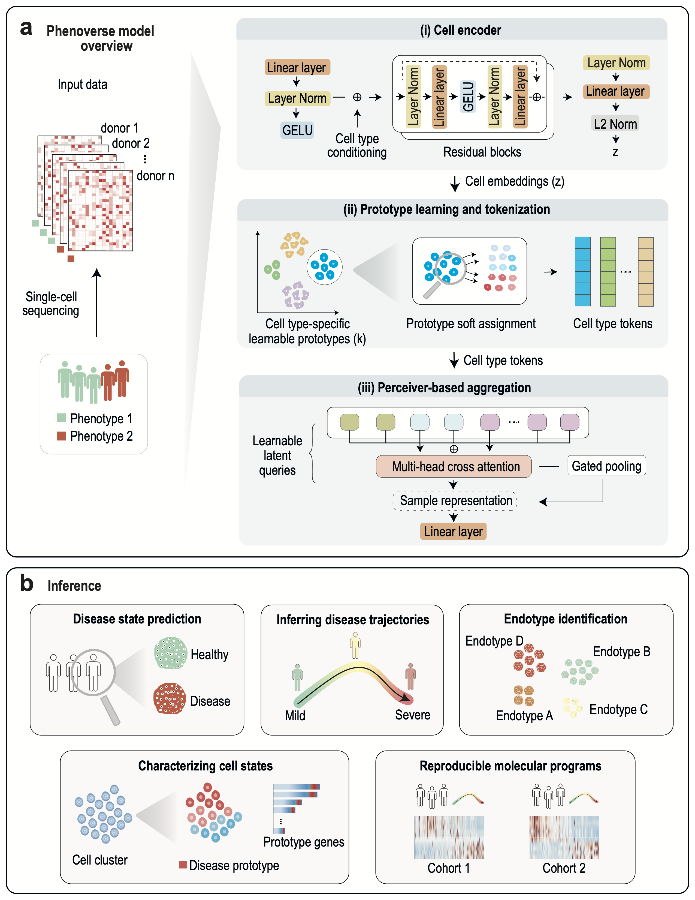

# Phenoverse

**An interpretable deep learning tool for learning sample representations and characterizing disease states in single-cell transcriptomics**

<figure markdown>
  { width="80%" }
</figure>

## Getting help

If you find a bug or run into any issues, please open an issue on <a href="https://github.com/KellisLab/Phenoverse" target="_blank">GitHub</a> and we will get back to you as soon as possible : )

 

---

  Documentation by <a href="http://manojmw.github.io" target="_blank">Manoj M Wagle</a>

